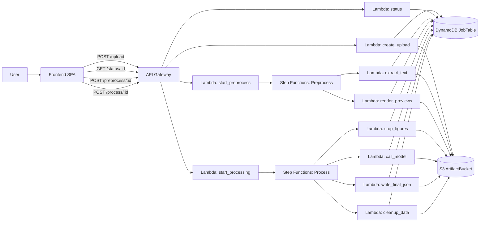
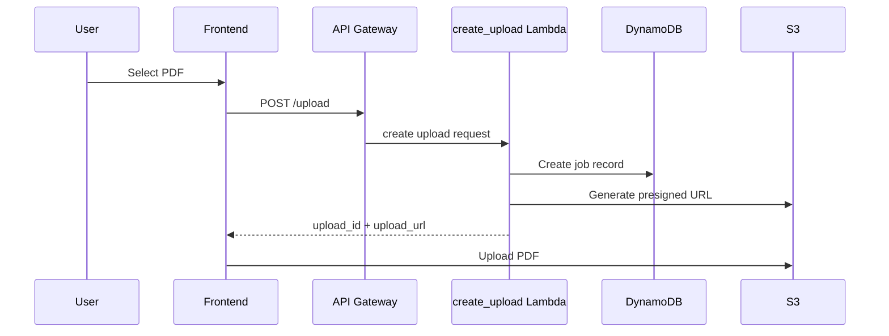
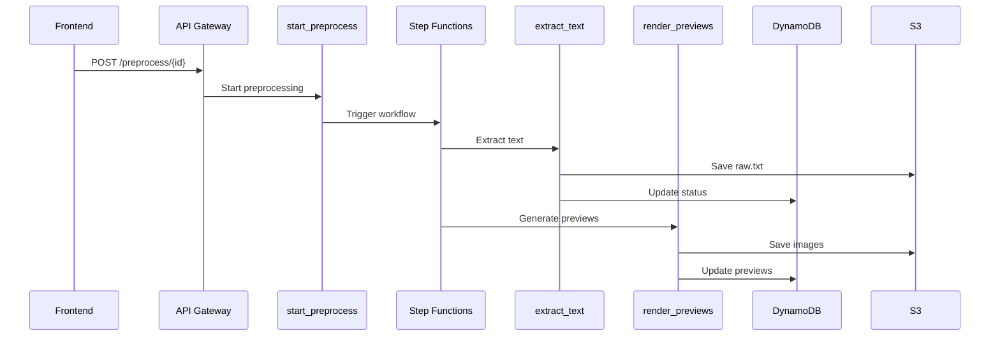
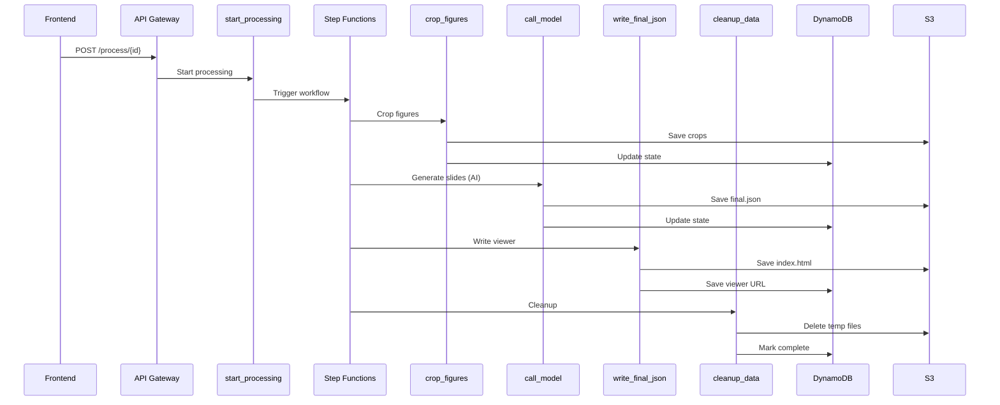

# 🚀 Make Presentation Simple

Transform PDFs into structured presentation decks using a fully serverless, AI-powered pipeline.

🌐 **Live App:**
[https://vakt-artifactbucket-vxgd6cj5bqrc.s3.us-east-1.amazonaws.com/index_.html](https://vakt-artifactbucket-vxgd6cj5bqrc.s3.us-east-1.amazonaws.com/index_.html)

---

## ✨ Overview

This project is a **serverless AWS application** that converts PDFs into presentation-ready slide decks using:

* 📄 PDF parsing
* 🖼️ Figure extraction
* 🤖 Multimodal + LLM processing
* ☁️ Fully managed AWS services

It leverages **AWS SAM**, **Step Functions**, and **Lambda** to create a scalable, event-driven pipeline.

---

## 🧠 High-Level Design (HLD)

### Architecture Summary

* **Frontend (SPA)** → Upload & interaction
* **API Gateway** → Entry point
* **Lambda Functions** → Business logic
* **Step Functions** → Workflow orchestration
* **S3** → File storage
* **DynamoDB** → Job tracking
* **Hugging Face Models** → AI generation

### 🔷 HLD Diagram

Paste this directly into a Markdown file that supports Mermaid:



---

---

## ⚙️ Low-Level Design (LLD)

### Core Workflows

#### 1️⃣ Upload Flow

Paste this directly into a Markdown file that supports Mermaid:



#### 2️⃣ Preprocessing Flow



#### 3️⃣ Processing Flow



---

## 🧩 Key Components

| Component          | Role                            |
| ------------------ | ------------------------------- |
| `create_upload`    | Initializes job + presigned URL |
| `extract_text`     | Extracts PDF text               |
| `render_previews`  | Generates page images           |
| `crop_figures`     | Crops user-selected regions     |
| `call_model`       | AI slide generation             |
| `write_final_json` | Publishes final output          |
| `cleanup_data`     | Removes temporary files         |

---

## ☁️ AWS SAM Deployment

### Prerequisites

* AWS CLI configured
* AWS SAM CLI installed
* Python 3.12

### 🔧 Build

```bash
sam build
```

### 🚀 Deploy

```bash
sam deploy --guided
```

During deployment, provide:

* Hugging Face API token
* Stack name
* Region

### 🔁 Subsequent Deployments

```bash
sam deploy
```

---

## 📦 Storage Structure (S3)

```
uploads/<upload_id>/
  ├── original.pdf
  ├── raw.txt
  ├── previews/
  ├── figures/
  ├── final.json
  └── index.html
```

---

## 🔄 State Management (DynamoDB)

Each job tracks:

* `state` (waiting, processing, done)
* `progress`
* `previews`
* `viewer_url`

---

## ⚠️ Notes

* The frontend currently triggers `/process/{upload_id}` immediately after upload (even for preprocessing).
* The backend separates preprocessing and processing workflows.

---

## 💡 Why This Project Matters

* Fully serverless → no infrastructure management
* Scalable pipelines via Step Functions
* Multimodal AI integration
* Real-world document understanding use case

---

## 📜 License

MIT License
